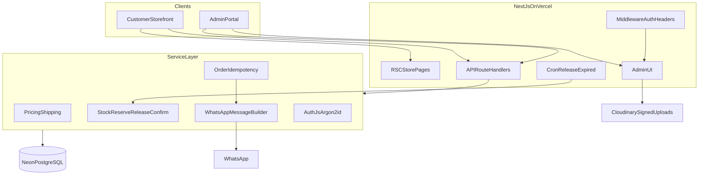

# Architecture

## Overview

ZAVÉLIA is a single Next.js App Router application with two experiences sharing one PostgreSQL database.

## Route groups

- `app/(store)/*` — public storefront
- `app/admin/*` — admin UI (login public; rest authenticated)
- `app/api/*` — REST handlers

## Money and inventory

- All money is integer **paise**
- Available stock = `stockOnHand - stockReserved`
- Order create reserves stock in a serializable transaction
- Confirm converts reservation to `STOCK_OUT`
- Cancel/expire/manual release creates `RELEASED` once (`stockReleasedAt`)

## Cart

Zustand + localStorage persistence only. Products and orders always come from PostgreSQL.

## Caching

Admin product writes call `revalidatePath` / `revalidateTag` so storefront updates without redeploy.
